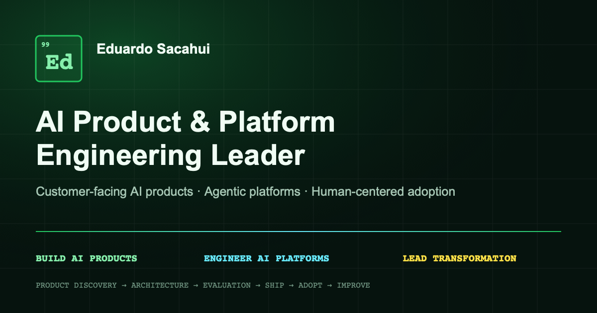

# Eduardo Sacahui — AI Product & Platform Engineering Portfolio

[](https://github.com/BernydotJar/Eduardo_Sacahui_Resume/actions/workflows/deploy.yml)

Professional portfolio and evidence base for Eduardo Sacahui, an **AI Product & Platform Engineering Leader** building customer-facing AI products, agentic platforms, governed delivery systems, and enterprise transformation programs.

**Live site:** [bernydotjar.github.io/Eduardo_Sacahui_Resume](https://bernydotjar.github.io/Eduardo_Sacahui_Resume/)



## What this portfolio demonstrates

- End-to-end ownership from product discovery and behavior contracts through architecture, evaluation, delivery, and adoption.
- Customer-facing AI product work with explicit users, maturity, human control, evidence, limitations, and next stages.
- Agentic and RAG platform engineering, including retrieval grounding, authorization boundaries, evaluation, observability, and fail-soft behavior.
- Leadership across product strategy, technical direction, enterprise platform ownership, team delivery, and organizational change.
- Historical automation and modernization impact preserved as enterprise-transformation evidence rather than the primary brand.
- A Human Systems perspective informed by an in-progress Master of Business Psychology, without claiming clinical expertise or unsupported people-analytics outcomes.

## Featured product categories

### Customer-facing AI products

- Executive AI Assistant — multi-surface pilot with read-only and approval-gated behavior.
- LA Muni RAG — public evidence-first Procedure Workflow Advisor MVP.
- AI Recruiting Copilot — interactive portfolio demo using mock data and recruiter-controlled decisions.

### AI platforms and developer tooling

- Harness SDLC — framework draft for governed coding-agent delivery; first workflow is `spec_ready`.
- RAG Made Easy — interactive browser learning experience.
- TimeEstimator — live RPA estimation developer preview with deterministic calculations and optional AI assistance.

### Enterprise transformation

- Platform modernization, cloud delivery, data-platform migrations, and governed automation programs.
- ConstructHub is presented honestly as an AWS deployment-validation demo whose customer product UX still requires a rebuild.

## Information architecture

1. Hero and primary positioning
2. Selected Product Impact
3. Customer-Facing AI Products
4. AI Platforms & Developer Tooling
5. Product operating model
6. Leadership & Employment
7. Selected Product & Client Engagements
8. Human Systems & AI Adoption
9. Technical Capabilities
10. Enterprise Transformation & Migrations
11. Education, Credentials & Recognition
12. Contact

Major products also receive statically exported, shareable `/projects/[slug]/` case-study routes with project-specific metadata.

## Technology

- Next.js 15 App Router with static export
- React 18 and TypeScript
- Tailwind CSS and Radix/shadcn UI primitives
- Framer Motion
- Local JSON/TypeScript content model
- English, Spanish, and Portuguese client-side localization
- GitHub Actions and GitHub Pages

## Local development

Prerequisites: Node.js 20+ and npm.

```bash
npm ci
npm run dev
```

Open [http://localhost:9002](http://localhost:9002).

## Quality commands

Run the same quality sequence used by CI:

```bash
npm run typecheck
npm run lint
npm test
npm run build
```

The production build does not ignore TypeScript or ESLint failures. Focused integrity tests protect product-first ordering, multilingual positioning, Pages metadata, public-status claims, and static project routes.

## Deployment

`main` deploys through [`.github/workflows/deploy.yml`](.github/workflows/deploy.yml):

1. Install the lockfile with `npm ci`.
2. Run typecheck, lint, and tests.
3. Build the static export under the repository `basePath`.
4. Add `.nojekyll` and upload `out/`.
5. Deploy through GitHub Pages.

The production URL and asset prefix are tied to `Eduardo_Sacahui_Resume`. If the repository is renamed, update `src/lib/site.ts`, `next.config.ts`, and the deployment workflow together.

## Content model

- Resume/project content: `src/data/`
- Project maturity and product-story fields: `src/lib/types.ts`
- Localized interface and curated product copy: `src/lib/i18n.ts`
- Persistent repositioning evidence: `docs/portfolio-repositioning/`
- Downloadable CV generator: `scripts/generate_cv_pdf.py` (requires Python 3 and `reportlab`)

Public claims are governed through `docs/portfolio-repositioning/claim-register.md`. Conflicting or incomplete evidence is labeled as pilot, MVP, demo, framework draft, staging validation, or in development rather than presented as production truth.

## Accessibility and responsive behavior

- Semantic headings and landmark sections
- Keyboard-addressable navigation and controls
- Visible focus treatment
- Reduced-motion support
- Responsive product grids and horizontally scrollable deep technical tables
- Client-side document-language synchronization for English, Spanish, and Portuguese

## Usage note

The application code is public for portfolio review and learning. Resume content, personal identity, customer context, and branded case-study copy are not granted for reuse as another person’s portfolio. No license is implied for confidential customer materials; none should be added to this repository.
